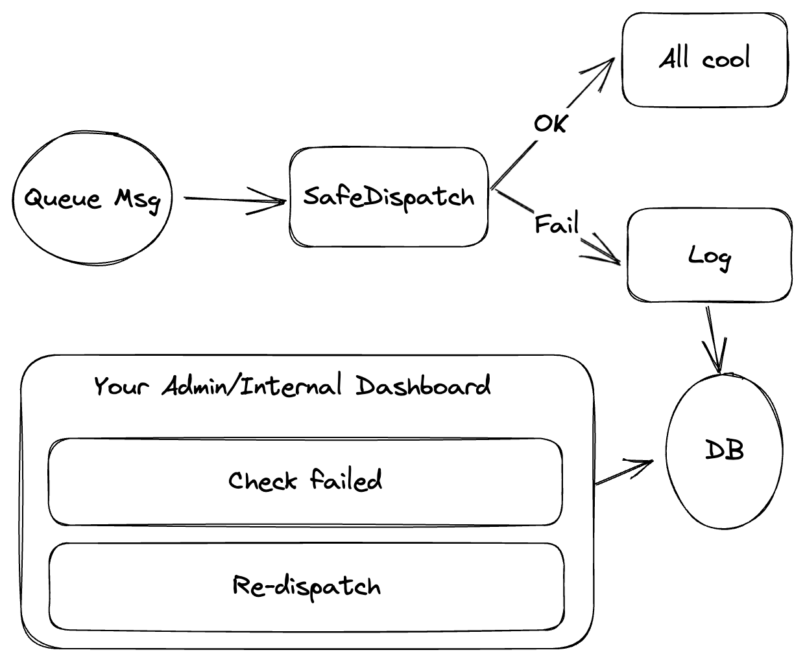

# Laravel Safe Dispatcher for Queues

[](https://github.com/shipsaas/safe-dispatcher/actions/workflows/build.yml)
[](https://codecov.io/gh/shipsaas/safe-dispatcher)

For Laravel, it has the Queues feature, all cool and easy to use, right?

But what if it **fails to dispatch a job**? Then you have no idea for:

- What was the data inside the msg?
- Resend the Queue msg

Then it will cost you a lot of time to check the log, sentry issues, create retry command,... Awful, IKR?

Worries no more, SafeDispatcher got your back. Check out how it works below.

Documentation:
- This README
- [APIs](./docs/APIs.md)
- [GUI](./docs/GUI.md)

## How SafeDispatcher works?



SafeDispatcher will:

- Stores the failed to dispatch msgs and help you to retry them.
- You can even change the connection driver or the name on retry.
  - Would really come in handy when you have a `SQSException` (size > 256kb), then you can resend using redis/database driver.
- Ensure that your processing/flow is still working properly (no 500 server error from HTTP or exceptions from queue worker).
  - Super useful for critical apps.

## Requirements
- Laravel 9+
- PHP 8.1+

## Installation

```bash
composer require shipsaas/safe-dispatch
```

## Usage

### Dependency Injection

```php
use SaasSafeDispatcher\Bus\SafeDispatcher;

class RegisterService
{
    public function __construct(public SafeDispatcher $dispatcher) {}

    public function register(): void
    {
        $user = User::create();
        
        $job = new SendEmailToRegisteredUser($user);
        $this->dispatcher->dispatch($job);
    }
}
```

### Use Trait for your Job

```php
use SaasSafeDispatcher\Traits\SafeDispatchable;

class SendEmailToRegisteredUser implements ShouldQueue
{
    use SafeDispatchable;
}

SendEmailToRegisteredUser::safeDispatch($user);
```

## Notes

- SafeDispatcher doesn't work with batching & chaining.
  - Alternatively, you can do normal `::safeDispatch` and after finish your job, dispatch another,...
- SafeDispatcher considers the `sync` Queue as a Queue Msg.
  - Therefore, if the handling fails, Queue Msg will be stored too.
- SafeDispatcher also has some implemented APIs too, check it out: [APIs](./docs/APIs.md)

## Tests
SafeDispatcher is not only have normal Unit Testing but also Integration Test (interacting with MySQL for DB and Redis for Queue).

We're planning to add other queue drivers too (database or SQS).

To run the test, hit this:

```bash
composer test
```

## Contribute to the project
- All changes must follow PSR-1 / PSR-12 coding conventions.
- Unit testing is a must, cover things as much as you can.

### Maintainers & Contributors
- Seth Phat

Join me 😉

## This library is useful?
Thank you, please give it a ⭐️⭐️⭐️ to support the project.

Don't forget to share with your friends & colleagues 🚀

## License
Copyright © by Seth Phat / ShipSaaS 2023 - Under MIT License.
